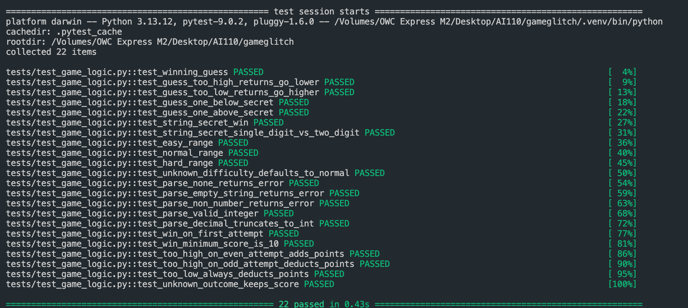

# 🎮 Game Glitch Investigator: The Impossible Guesser

## 🚨 The Situation

You asked an AI to build a simple "Number Guessing Game" using Streamlit.
It wrote the code, ran away, and now the game is unplayable.

- You can't win.
- The hints lie to you.
- The secret number seems to have commitment issues.

## 🛠️ Setup

1. Install dependencies: `pip install -r requirements.txt`
2. Run the broken app: `python -m streamlit run app.py`

## 🕵️‍♂️ Your Mission

1. **Play the game.** Open the "Developer Debug Info" tab in the app to see the secret number. Try to win.
2. **Find the State Bug.** Why does the secret number change every time you click "Submit"? Ask ChatGPT: *"How do I keep a variable from resetting in Streamlit when I click a button?"*
3. **Fix the Logic.** The hints ("Higher/Lower") are wrong. Fix them.
4. **Refactor & Test.** - Move the logic into `logic_utils.py`.
   - Run `pytest` in your terminal.
   - Keep fixing until all tests pass!

## 📝 Document Your Experience

**Game Purpose:**
A number guessing game built with Streamlit where the player tries to guess a secret number within a limited number of attempts. The game supports three difficulty levels (Easy: 1–20, Normal: 1–100, Hard: 1–50) and tracks a running score across rounds.

**Bugs Found:**

1. **Reversed hints** — `check_guess` returned "Go HIGHER!" when the guess was too high and "Go LOWER!" when it was too low.
2. **Secret number instability** — Without `st.session_state`, `random.randint()` was called on every Streamlit rerun, generating a new secret each time a button was clicked.
3. **Difficulty range ignored on New Game** — The "New Game" button used a hardcoded `random.randint(1, 100)` instead of pulling the range from the selected difficulty.
4. **Attempts counter off-by-one** — `st.session_state.attempts` was initialized to `1` instead of `0`, causing the attempt display to be one ahead.
5. **Double-submit required** — Without `st.form`, Streamlit processed the text input and button click in separate reruns, so the first click did nothing visible.
6. **Stale hint after game over** — The last hint message persisted on screen after the game ended.

**Fixes Applied:**

- Swapped the hint strings in `check_guess` in `logic_utils.py` so "Go LOWER!" fires when guess > secret and "Go HIGHER!" fires when guess < secret.
- Wrapped the secret-number initialization in an `if "secret" not in st.session_state` guard so it is only generated once per game session.
- Updated the New Game button to call `get_range_for_difficulty(difficulty)` and pass `low`/`high` to `random.randint`.
- Changed the initial value of `st.session_state.attempts` from `1` to `0`.
- Wrapped the guess input and submit button in `st.form` so both values are captured in a single rerun.
- Added `st.session_state.last_hint` to store hints separately, cleared on new game, so the hint area shows nothing after a game-over reset.
- Refactored all game logic (`check_guess`, `parse_guess`, `get_range_for_difficulty`, `update_score`) out of `app.py` and into `logic_utils.py` for easier testing.
- Expanded `pytest` test coverage in `tests/test_game_logic.py` to cover edge cases for all four logic functions.

## 📸 Demo

## 🚀 Stretch Features

- [ ] [If you choose to complete Challenge 4, insert a screenshot of your Enhanced Game UI here]
